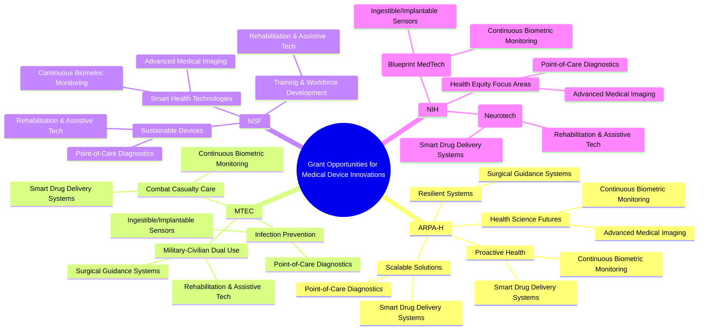

# Edge AI for Healthcare
***Experimental and Research Use only***

## Mindmap


## Platform Design


## Sequence Diagram: Healthcare Edge Computing Network Data Flow


## Implementation

Incremental R&D approach:

1. Hands on device to start MQTT transmission to jetstream
2. NVIDIA Spark as Edge AI processor - allows performant models at the edge with Memory Bandwidth and GPU acceleration
3. Map DB Schema
4. Define API Security Access & Control for downstream health providers

## Directory Structure

```sh
├── config
│   ├── mqtt.conf # Example MQTT configuration for Secure Edge Messaging
├── examples
│   ├── device-publisher # Example Stream Worker Queue Logic that can compile to a Golang binary
│   │   ├── go.mod
│   │   ├── go.sum
│   │   └── main.go
├── docs
│   ├── edgeai-icp-mil-tech-si.md # Edge AI Inter Cranial Pressure Monitoring System Technical Strategy
│   └── icp-proposal-arch.md # Edge AI Inter Cranial Pressure Monitoring System Proposal Architecture
└── README.md