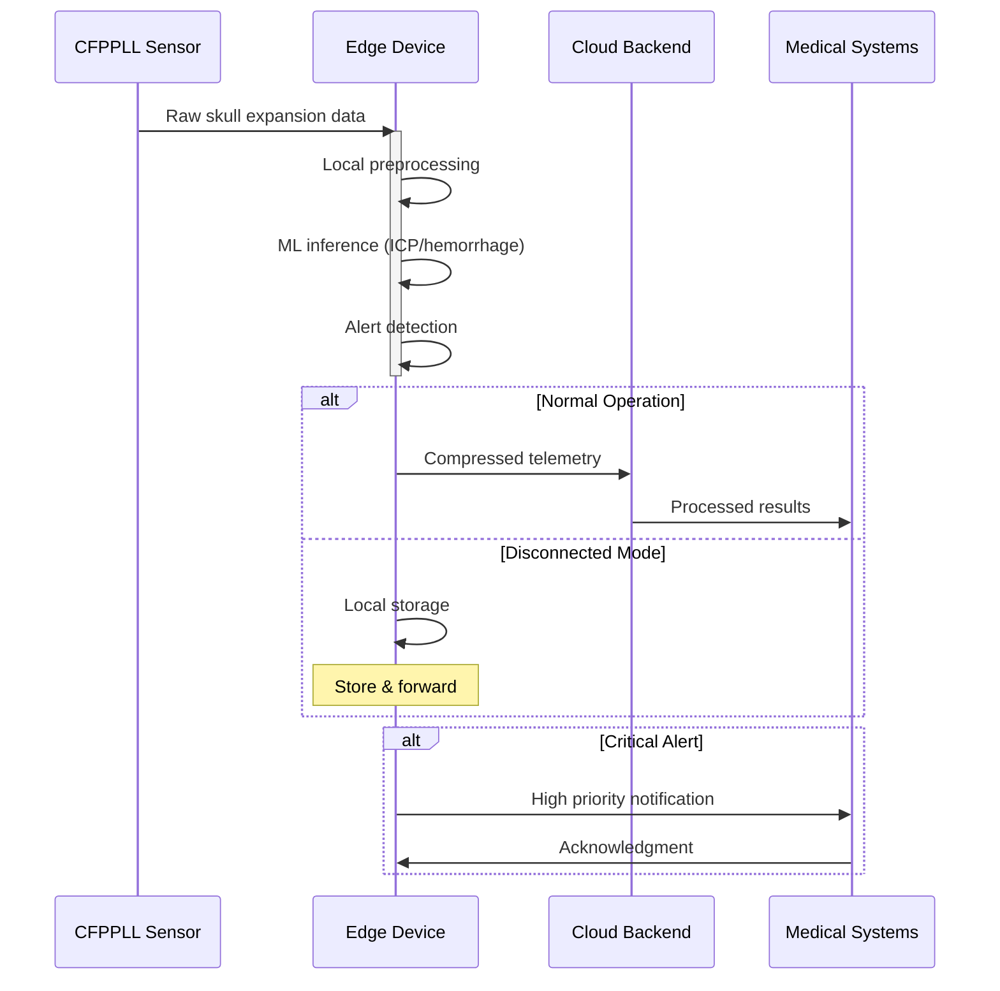
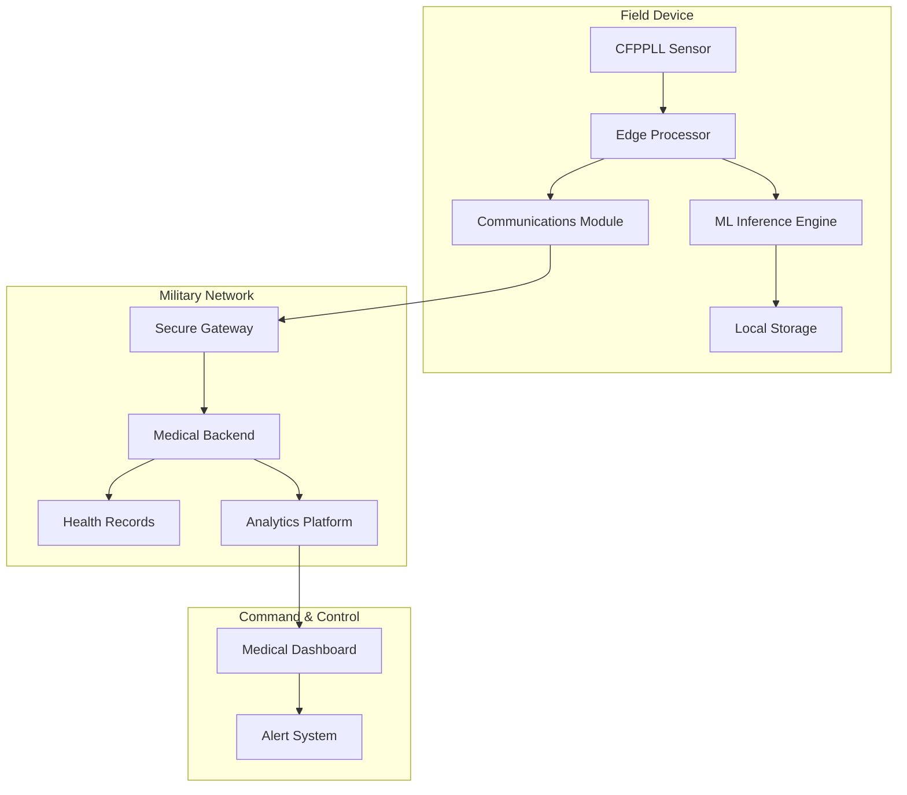

# EdgeAI ICP Monitoring System Technical Strategy
v1.0 | February 2025
Author | Tobalo Torres-Valderas (tobalo@yeetum.com)
Reviewer | 
Status |
Approval |
Last Updated | 02/13/2025

## Overview

This document outlines the technical architecture and implementation strategy for an edge-based intracranial pressure (ICP) monitoring and hemorrhage detection system for military field use.

## System Architecture

### Data Flow Sequence

### Deployment Architecture

### Security Architecture

## Technical Requirements

### Edge Device Specifications

- **Processing:** Low-power AI accelerator
- **Memory:** 4GB RAM minimum
- **Storage:** 128GB encrypted flash
- **Battery:** 24hr continuous operation
- **Size:** <3ft³
- **Weight:** <10lbs
- **Environmental:** MIL-STD-810G
- **Display:** Ruggedized touchscreen

### ML Model Requirements

- **Inference time:** <5sec
- **ICP accuracy:** ±2mmHg (0-20mmHg)
- **Hemorrhage detection:** >95% sensitivity
- **Model size:** <100MB
- **Power usage:** <2W during inference

### Security Requirements

- **Encryption:** FIPS 140-3 Level 3
- **Architecture:** Zero trust architecture
- **Boot Security:** Secure boot and attestation
- **Access Control:** Role-based access control
- **Monitoring:** Audit logging and monitoring
- **Offline Mode:** Offline operation capability

### Implementation Phases

#### Phase 1: Core Development (0-12 months)

- CFPPLL sensor integration
- Edge ML pipeline development
- Basic hemorrhage detection
- Environmental testing
- FDA submission preparation

#### Phase 2: Advanced Features (12-24 months)

- Predictive analytics
- Multi-sensor fusion
- Extended clinical validation
- Security hardening
- Field testing

#### Phase 3: Deployment (24-36 months)

- Military health systems integration
- Training development
- Mass production
- Deployment support
- Post-market surveillance

## Success Metrics Framework - EdgeAI ICP Monitoring System

### Technical Performance Metrics

| Metric | Target | Testing Method | Validation Criteria |
|--------|---------|----------------|-------------------|
| ICP Accuracy | ±2mmHg | Controlled lab testing vs invasive ICP monitoring | 95% of measurements within range over 24hr period |
| Hemorrhage Detection | >95% sensitivity | Clinical validation studies with CT confirmation | False negative rate <5%, PPV >90% |
| System Uptime | >99.9% | Field reliability testing in austere conditions | Maximum 9 hours downtime per year |
| Battery Life | >24 hours | Continuous operation stress testing | Full functionality maintained at 20% battery |

### Clinical Performance Metrics

| Metric | Target | Testing Method | Validation Criteria |
|--------|---------|----------------|-------------------|
| Time to Detection | <5 minutes | Simulated emergency scenarios | From onset to alert generation |
| False Alarm Rate | <1% | Extended monitoring studies | Confirmed by clinical review |
| Data Completeness | >98% | Field deployment validation | Critical data points captured |
| Clinical Decision Time | Reduction by 50% | Comparative effectiveness study | vs. standard monitoring methods |

### Operational Performance Metrics

| Metric | Target | Testing Method | Validation Criteria |
|--------|---------|----------------|-------------------|
| Field Reliability | MTBF >5000 hrs | Military field testing | Under combat conditions |
| User Proficiency | >90% | Training effectiveness evaluation | Task completion assessment |
| Deployment Time | <5 minutes | Field exercise timing | From pack to patient monitoring |
| Network Resilience | 100% data retention | Disconnected operations testing | No data loss during outages |

### Regulatory and Compliance Metrics

| Metric | Target | Testing Method | Validation Criteria |
|--------|---------|----------------|-------------------|
| FDA Clearance | 510(k) approval | Regulatory submission | All requirements met |
| Military Standards | MIL-STD-810G | Environmental testing | All test cases passed |
| Cybersecurity | NIST CSF | Security assessment | No high/critical findings |
| Data Privacy | HIPAA Compliant | Privacy impact assessment | All controls validated |

## Implementation Notes

The metrics framework above establishes quantifiable targets across four critical domains:

1. Technical Performance validates the core capabilities of the ICP monitoring system, ensuring accuracy and reliability meet military medical requirements.

2. Clinical Performance measures focus on the system's effectiveness in real-world medical scenarios, with emphasis on rapid and accurate detection of critical conditions.

3. Operational Performance addresses the practical aspects of field deployment, including ease of use and resilience in austere environments.

4. Regulatory and Compliance metrics ensure the system meets all necessary standards for military medical devices while maintaining data security and privacy.

Each metric includes:
- A specific, measurable target
- A defined testing methodology
- Clear validation criteria

This comprehensive framework supports both the development process and eventual FDA clearance by providing objective measures of system performance and effectiveness.

### Reporting and Review

Performance against these metrics should be:
- Tracked continuously during development
- Reviewed monthly by the project team
- Reported quarterly to stakeholders
- Formally assessed before phase transitions
- Included in FDA submission documentation

### Updates and Revisions

This metrics framework should be reviewed and updated:
- At the completion of each development phase
- When new military requirements are identified
- Following significant technical changes
- Based on field testing feedback

Any changes to metrics must be documented and approved by relevant stakeholders, including military medical leadership and regulatory advisors.

### References

1. MIL-STD-810G Environmental Requirements
2. FDA Guidelines for Medical Devices
3. NATO STANAG Health Information Systems
4. NIST Cybersecurity Framework