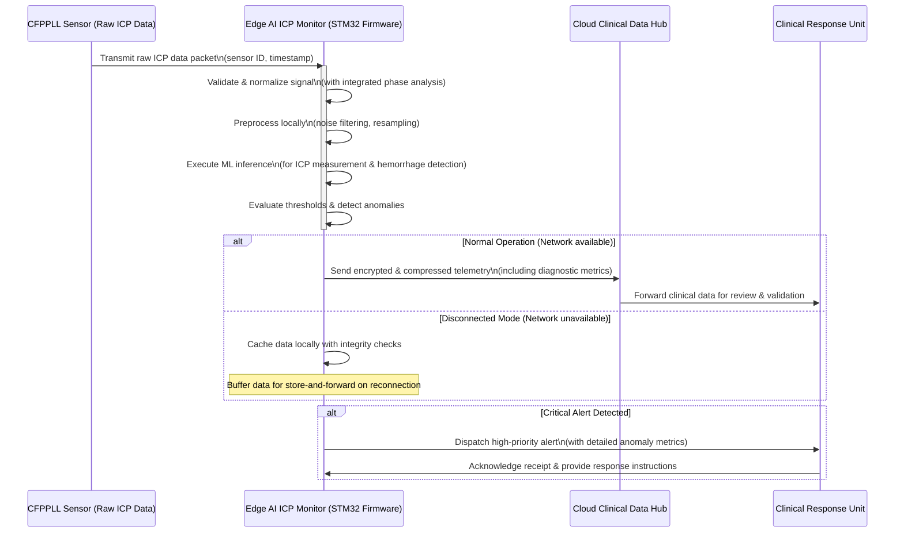

```mermaid
sequenceDiagram
    participant S as CFPPLL Sensor (Raw ICP Data)
    participant E as Edge AI ICP Monitor (STM32 Firmware)
    participant C as Cloud Clinical Data Hub
    participant M as Clinical Response Unit

    S->>E: Transmit raw ICP data packet\n(sensor ID, timestamp)
    activate E
    E->>E: Validate & normalize signal\n(with integrated phase analysis)
    E->>E: Preprocess locally\n(noise filtering, resampling)
    E->>E: Execute ML inference\n(for ICP measurement & hemorrhage detection)
    E->>E: Evaluate thresholds & detect anomalies
    deactivate E

    alt Normal Operation (Network available)
        E->>C: Send encrypted & compressed telemetry\n(including diagnostic metrics)
        C->>M: Forward clinical data for review & validation
    else Disconnected Mode (Network unavailable)
        E->>E: Cache data locally with integrity checks
        Note over E: Buffer data for store-and-forward on reconnection
    end

    alt Critical Alert Detected
        E->>M: Dispatch high-priority alert\n(with detailed anomaly metrics)
        M->>E: Acknowledge receipt & provide response instructions
    end
```